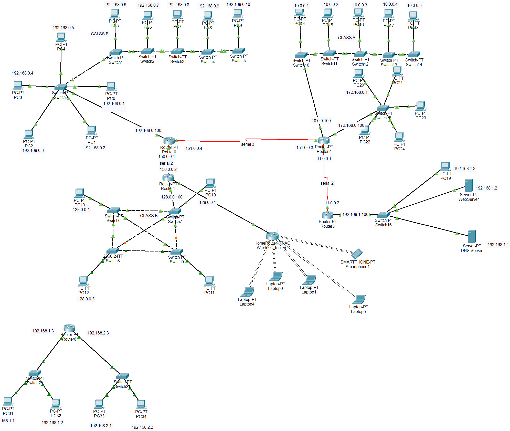

# Enterprise Network Topology – Cisco Packet Tracer Final Project

## Overview
This is my final networking project built in **Cisco Packet Tracer** for a fictional **clothing company**. It demonstrates the practical implementation of network design, IP addressing, switching, routing, VLAN segmentation, Wi-Fi configuration, and multiple topology types (bus, star, ring, mesh).

The design focuses on **real-world scenarios** like departmental scaling, security enforcement, DHCP usage, and DNS setup.

## 🧱 Departments Covered
- Designing Team 1 (Bus Topology)
- Designing Team 2 (Star Topology)
- Sales Team (Bus Topology)
- Accounting Team (Bus Topology)
- Management Team (Ring Topology)
- Security Team (Mesh Topology)
- Wi-Fi Access Zone

## 🗺️ Network Topologies Used
| Department       | Topology Type | Why Chosen |
|------------------|---------------|------------|
| Designing Team 1 | Bus           | Cheap, scalable for growing design team |
| Designing Team 2 | Star          | Easy maintenance and fault isolation |
| Sales & Accounting | Bus         | Designed for department expansion |
| Management       | Ring          | Minimal change expected, stable connection |
| Security         | Mesh          | Highly secure, redundant, and fast |
| Wi-Fi Zone       | Wireless      | For employees with laptops or mobile devices |

## ⚙️ Features Implemented
- IP Addressing (Static and DHCP)
- DNS Configuration with web access
- MAC Address inspection
- Router CLI Password Protection
- Wi-Fi Password Security
- Ping and Connectivity Testing
- OSI Layer Explanation with Simulation
- Port & Socket Demonstration (Layer 4)
- Subnetting for Department Segregation
- Attack Simulation + Access Control

## 📹 Video Demonstration
Watch the complete walkthrough of the project here:  
👉 [Demo Video](https://drive.google.com/drive/folders/1RD8ErEIIjjtT6bIaWdrqLf3RH6SYJHCv?usp=sharing)

> The video covers full explanation of topologies, device roles, addressing, simulation, and real-time CLI usage.

## 📁 Files Included
- `finalProject.pkt` – Cisco Packet Tracer Project File
- `video_link.txt` – Link to the project demo (optional)
- `README.md` – Documentation

## 📌 Key Technologies
- Cisco Packet Tracer
- Static and Dynamic IP Addressing
- Routing & Switching
- DHCP & DNS
- OSI Layer 1–4 Concepts
- Network Security

## 📖 Concepts Covered
- MAC Address vs IP Address
- DHCP vs Static IP
- Ports & Sockets
- Network Simulation via ICMP (Ping)
- DNS Resolution
- Router CLI Security
- Wi-Fi Configuration
- Subnetting and Topology Design

## 📚 Summary
This project showcases my ability to design, configure, and secure a full-scale enterprise network in Cisco Packet Tracer — incorporating multiple departments and network types while ensuring practical use of addressing, simulation, and user accessibility.

---

## 📎 How to Use
1. Download `finalProject.pkt`
2. Open in Cisco Packet Tracer
3. Explore configurations on routers, switches, PCs
4. Use simulation mode to test connectivity and observe OSI layers
